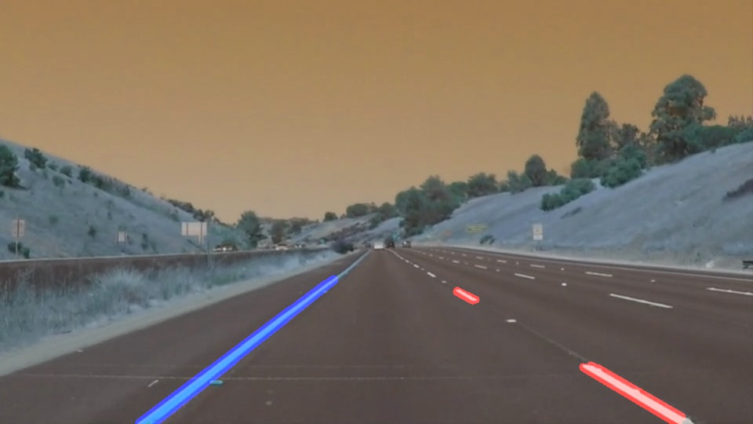
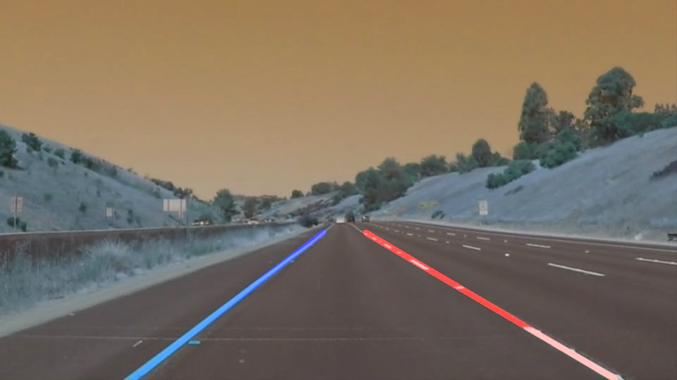

# **Finding Lane Lines on the Road** 
[](http://www.udacity.com/drive)


Overview
---

First all helper functions that will be needed during the pipeline are added under “Helper Functions” section in the code *P1.ipynb*. Each one of them will be described during pipeline description. Some of which are being provided by Udacity and some others are added as part of this project.  The main code that is being used for this project also works for the *Challenge*. In other words the code is good enough to work on the Challenge video as well. I used this [link](https://goo.gl/Yzyr73) for some parts of my code base specially extracting white and yellow sections of the line.
<br></br>
<br>Note1: When we talk about images it could also mean a frame of the video that we are processing.</br>
<br></br>


Part1: Pipeline
---
*The pipeline along with the corresponding python function or helper function is described. For more details please refer to the code P1.ipynb*

<br></br>
I. Reading input images/videos. ```mpimg.imread()```
<br></br>
II. Changing RGB pixel values into HLS. ```rgb_to_hls()```
<br></br>
III. Defining some threshold in order to extract white and yellow sections of the image and using it as a mask on the image itself for separating pixels with those ```colors.yellow_section() white_section() cv2.bitwise_or() cv2.bitwise_and()```.
<br></br>
IV. Converting the filtered images into gray scale for edge detection. ```grayscale()```
<br></br>
V. Using Gaussian filter in order to blur the gray scale image. Doing so will decrease the amount of noise and make it ready for edge detection which is next stage. ```gaussian_blur()```
<br></br>
VI. Using Open CV canny edge detection package for detecting edges from previous blurred image. ```canny()```
<br></br>
VII. Defining region of interest (ROI) that we would like to draw lane lines inside the image. Region of interest is based on x-y coordinates and is polygon-shaped area that is specified manually in the code. One of the future works that we’ll cover in the conclusion could be to automatically extract region of interest. By having x-y coordinates of region of interest, all other areas that are outside polygon will be ignored and just the area inside polygon will considered for the next step. ```region_of_interest()```
<br></br>
VIII.	Hough line transform will be used to extract the edges that form a line inside ROI. Since all other areas outside ROI are ignored, Hough line transform looks for edges that form a line inside the region of interest. Once the lines are extracted, these lines will be drawn on the input image which will result in the first output of our pipeline as shown below. ```hough_lines() draw_lines()```
<br></br>

<br></br>
IX.	In order to connect the lines segments together and form a straight line we need to separate left and right lines from each other. Hough transform output lines will be used, those that have negative slope will be categorized as left segment and the ones with positive slope as right segments. ```left_right()```
<br></br>
X.	Now, there are two categories of lines. Lines on the left side of the region and lines on the right side of the region. All lines on the left side of the region need to be extrapolated and be represented as a single line, the same is true for the lines on the right side of the region of interest. We just describe the details about the lines on the left side of the ROI, the same can be generalized for the lines on the right side of the ROI. In order to represent multiple lines on the left side of the ROI as a single line, we first get ride of the lines that their slope is not in a certain threshold gap, because those lines might be cracks in the road, tree branches, shadows, car windshield cracks, etc. The remaining lines are passed into a linear regressor and it will return the slop and intercept of the line. ```slope_intercept(), slope_2_line()```
<br></br>
XI.	Now there are two lane lines, one on the right and one on the left. We just add this line to the original image and the result is shown below. ```draw_lane()```
<br></br>

<br></br>
XII.In order to draw lane lines on a video moviepy package will be used. Udacity already provided the code, I just put my code in the form of a function. This function returns the extrapolated right and left lanes for each video frame. Moviepy will take care of the rest of it and connects all frames to each other so that we can see continues video. ```videoFileClip() fl_image() write_videofile()```
<br></br>
XIII.The code that we developed is robust enough to work for the challenge videos.
<br></br>


Shortcomings
---

There are two major shortcomings with this approach:
<br></br>
I. Right now user specifies the corners of the polygon in order to construct the area of interest. This could be tedious for the real world applications since area of interest is not always the same for all road, video quality. As a result this approach might not be generalizable to cases in which there are multiple lines and also cases in which video frame sizes are different from our videos.
<br></br>
II.	There is small jittering on the lane lines (red/blue line). Ideally we want to get rid of this jittering. We want to use these identified lane lines to steer the wheel in the right direction, having these jittering can possibly make the wheels to steer unnecessarily.
<br></br>

Possible Improvements
---

I. I can think of three ways to choose region of interests automatically:
<br></br>
a. Developing a new way for identifying the region of interest. In this approach we can start with some region of interest that corresponds to the frame size and then start detecting the lines in that region. In order to check the validity of the extracted lines we could construct a feedback loop that checks whether the lines are in certain threshold. If not we increase the region of interest size until we get to our desired lane lines.
<br>
b. Camera calibration on the car: This way we always know where the lines are going to be and look for lines in those areas.
</br>
<br></br>
II. One of the possible reasons for extracted lane line jittering could be calculation that is being done for each frame. Right now the algorithm tries to find the slope and intercept for each frame separately, which in turn updates extracted red/blue lines on the output video. Due to possible tiny changes in consecutive frames, the jittering happens in the final line lanes. In order to improve these, the line could be the average of the previous few frames and make the change very smooth so that we can have smoother line changes in the output video. 
<br></br>
III. Skipping some of the frames in order to speed up the process. If the video has 30 frames per second, the same computations are being done 30 times over 1 second period of time. This could be speed up by skipping the frames that are almost the same as the previous frames.
<br></br>


